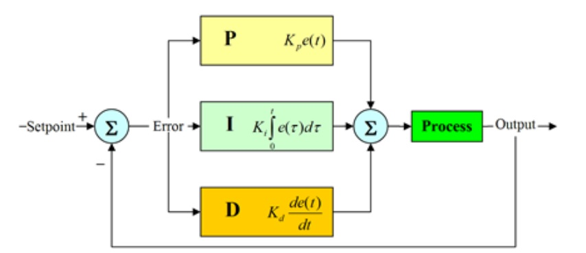
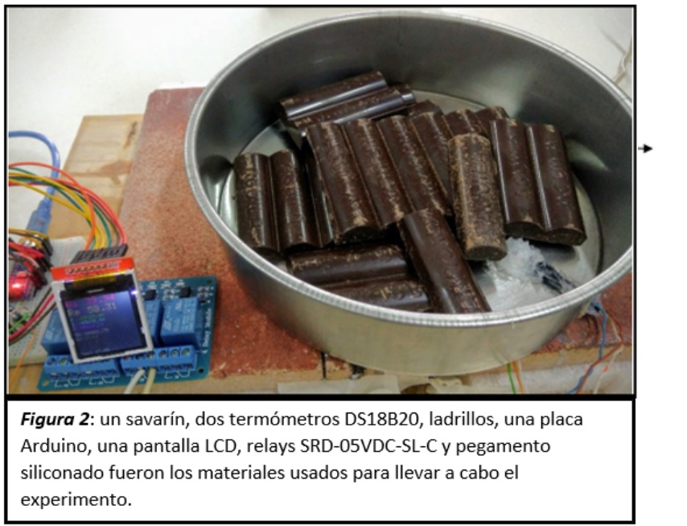
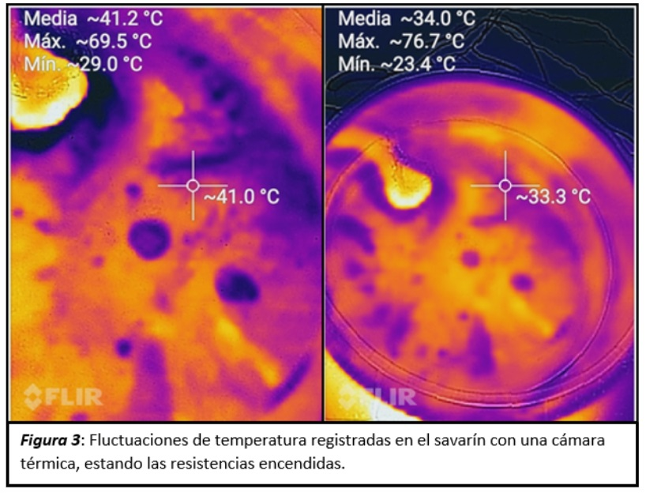
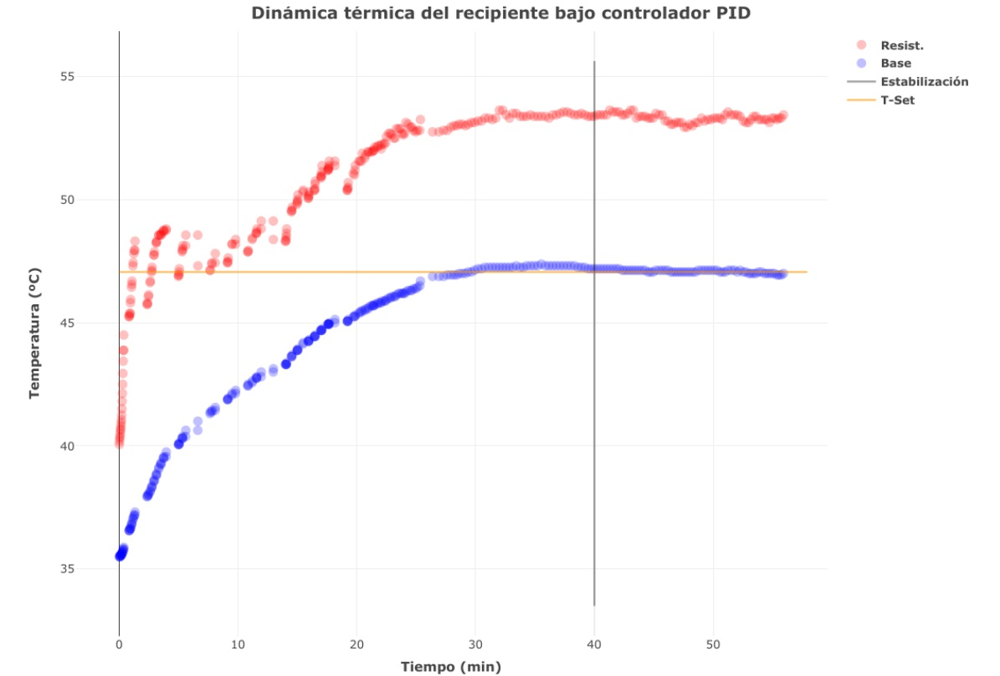
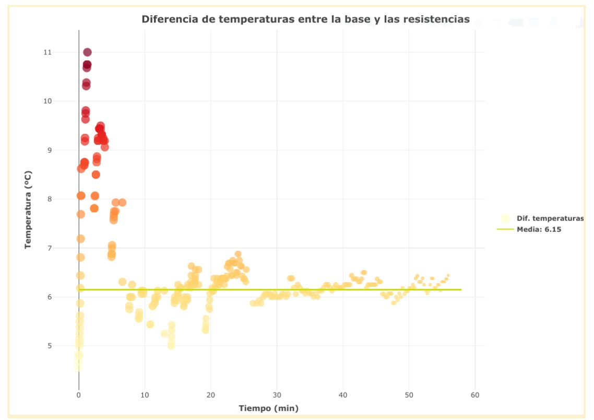

## Control de templado usando un PID (controlador proporcional, integral y derivativo) 

Castillo Josefina, Preve E. Kiernan

Universidad Nacional de San Luis
 
### Resumen

En aplicaciones industriales, se necesita mantener el chocolate que se encuentra en templado a temperatura de trabajo. 

Para este problema existe una posible solución: un controlador P.I.D., que calcula un valor de error como la diferencia entre un punto de medida y un punto deseado, e intenta minimizar este error en una salida. Lo que se quiere lograr es que la salida se ajuste a su setpoint (valor de referencia al que queremos llegar). 

Para este experimento se trabajó con 400 gramos de chocolate semi-amargo.  Según el nivel de pureza se tendrán diferentes puntos de fusión para cada tipo de chocolate, para este caso, se encontraría entre 45°-50°.

El chocolate líquido a 32° posee un calor específico de 0.56 kcalkg °C, mientras que el chocolate sólido tiene un calor específico de 0.30 kcalkg °C [1].

### Otros casos de uso para un PID

Se puede utilizar este tipo de controladores para una gran variedad de aplicaciones, tales como:

Estabilización de un cohete durante la fase de despegue.
Control de movilidad de un vehículo de exploración espacial (Rover).
Implementación del modo crucero en un automóvil. 

### Modelado

	El sensor PID se compone de una señal proporcional, una integral, y una derivativa. 

Proporcional (P): asciende exponencialmente para llegar al setpoint, centrándose en un valor preciso de medida (el que se está midiendo en el momento) y consiste en el producto entre el error de la medida y una constante Kp. 
Integral (I): revisa el error acumulado en el tiempo (es decir, se enfoca en errores de las medidas que tenemos hasta el momento) y actualiza la componente actual, es decir, disminuye y elimina el error en estado estacionario, provocado por perturbaciones exteriores y los cuales no pueden ser corregidos por el control proporcional. También depende de una constante Ki.
Derivativa (D): se centra en los errores futuros de las medidas. La función de la acción derivativa es mantener el error al mínimo corrigiéndolo proporcionalmente con la misma velocidad con la que se produce; de esta manera evita que el error se incremente y también que los valores excedan el setpoint. Cuando el tiempo de acción derivada es grande, hay inestabilidad en el proceso. Cuando el tiempo de acción derivada es pequeño la variable oscila demasiado con relación al punto de consigna. [3]

La salida será igual a la suma de estas tres señales.
Esto caracterizará un tiempo de retardo utilizado para controlar el apagado/encendido de las resistencias, dado por la ecuación

                                             error = Tset-T(t)			    [3]

      tretardo = Kp [e + Ki(Iprev+e(t-tprev)) +Kd (e-eprev)/(t-tprev)]  
 	

Figura 1: Elementos que componen la señal del sensor PID  

### Configuración experimental

Se comienza armando una especie de hornalla con ladrillos refractarios y tres resistencias que funcionarán como una sola que disipa 270 W. Debido a la configuración de este sistema en particular, donde a la hora de encender las resistencias no habrá suficiente espacio para dejar escapar el calor, los ladrillos lo “almacenarán”, haciendo que resulte más difícil disminuir la temperatura. Es por eso que una de las situaciones que podrían ocurrir es  que la temperatura final no se encuentre en el Tset inicial, sino que sea mayor a éste.  

El chocolate se calienta en un savarín, y bajo él las resistencias son alimentadas por una corriente de 220 V (Figura 2). Junto con el sensor PID se pretende mantener la temperatura de la base estable, a 45 °C.

### Resultados

	En la figura 3 pueden observarse ciertas inhomogeneidades en el recipiente. Esto ha de tenerse en cuenta a la hora de medir, pues es importante saber que los diferentes puntos de la base no llegan a la misma temperatura al mismo tiempo, pero en presencia del chocolate que cubrirá todo el fondo, estas irregularidades se suavizan debido a que éste distribuiye la temperatura uniformemente. Además, puede verse que el termómetro visible en la imagen cuenta con un pegamento aislante, el cual disipa el calor mucho más lentamente que la superficie metálica, conservándolo por mucho más tiempo, y a la vez generando un tiempo de demora entre la temperatura del chocolate y el sensor en su interior.

Figura 4

Debido al ladrillo refractario sobre el que están colocadas las resistencias, la temperatura final a la que finalmente llega el chocolate resulta ser dos grados mayor a lo seteado, pues este material cerámico posee una baja conductividad térmica, almacenando parte del calor por un tiempo considerable.

Se trabajó este PID para actuar sobre la temperatura de la base del savarín, en la cual se encontraba un termómetro, el cual nos daría valores sobre los cuales controlar. Mientras tanto, otro termómetro junto a las resistencias registra la temperatura por debajo del recipiente (Figura 4).
Se llegó a la estabilidad en la temperatura seteada aproximadamente a los 40 minutos, siendo la diferencia térmica entre los dos sensores de(6.150.5)ºC (Figura 5)

    Figura 5

### Conclusión

Es factible controlar la temperatura de un sistema solo con resistencias, sensores y una placa arduino con un código que se comporta como un PID, escrito por el equipo; pudiendo llegar a una temperatura deseada y mantenerla estable en el tiempo.
Hay que tener en cuenta la elección de los materiales adecuados, especialmente la superficie donde irá apoyado el sistema a controlar; así como también la propia temperatura del ambiente, dado que si esta es muy cercana a la seteada, posiblemente se degrade la estabilidad del control.

### Bibliografía 
[1] Rudolf Plank, “El empleo del frío en la industria de la alimentación”,  Sección “Chocolate y dulces”, Capítulo IV

[2] Wikipedia, “Controlador PID” 

[3] “Manual de usuario de controlador de temperatura”, Modelo 331, Lake Shore Cryotronics, Inc.

#### Apéndice
Tim Wescott, “PID without a PhD”
